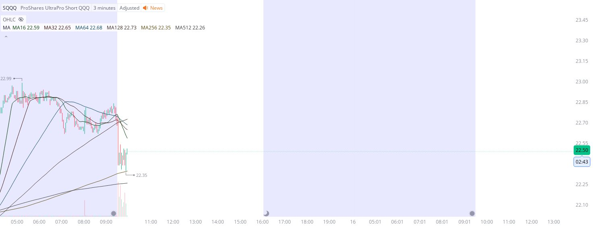

# Case Study #11 - Singular Point Hard Stop Order

**Archived from:** https://x.com/rauItrades/status/1933523365807206567  
**Post ID:** `1933523365807206567`  
**Posted:** 2025-06-13T13:54:28.000Z  
**Author:** @UnfairMarket (Unfair Market)  
**Thread posts captured:** 1  
**Status:** PARTIAL - conversation reports 3 replies; the public embed endpoint exposes a post's ancestors but not its descendants, so the forward reply chain is not archived.

---

### 1. `1933523365807206567` - 2025-06-13T13:54:28.000Z

EXT SESSION CHART on
SQQQ at 22.35
3M MA16 MA32 MA64 MA128 MA256 MA512.
I've purchased the SQQQ with a hard stop order at the 
3M MA256 at 22.34 https://t.co/74wzIW6XoC

metrics @capture - likes 0 / replies 0 / reposts 0 / quotes 0 / views 0

---
