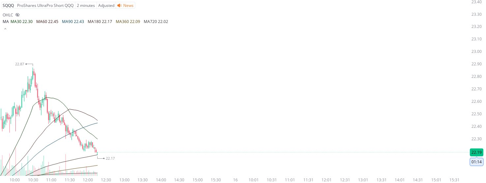

# Case Study #39 - Precision Buy Algorithm

**Archived from:** https://x.com/rauItrades/status/1933558926118969700  
**Post ID:** `1933558926118969700`  
**Posted:** 2025-06-13T16:15:46.000Z  
**Author:** @UnfairMarket (Unfair Market)  
**Thread posts captured:** 1  
**Status:** PARTIAL - conversation reports 3 replies; the public embed endpoint exposes a post's ancestors but not its descendants, so the forward reply chain is not archived.

---

### 1. `1933558926118969700` - 2025-06-13T16:15:46.000Z

I should have waited for this one.
REVERSAL OUTFIT 180.
MA180
SQQQ at 22.17 . IM LONG SQQQ. https://t.co/9tGzVxZbKV

metrics @capture - likes 0 / replies 0 / reposts 0 / quotes 0 / views 0

---
