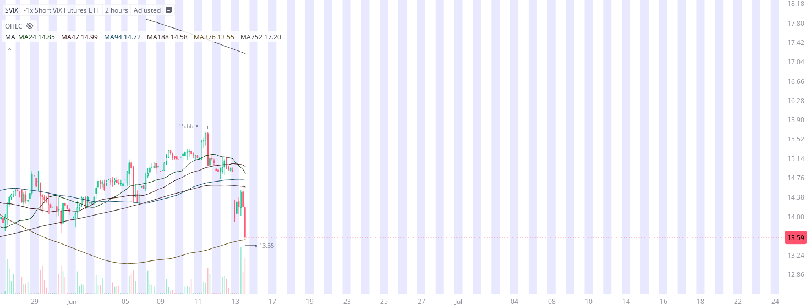

# Case Study #12 - Singular Point Hard Stop Order

**Archived from:** https://x.com/rauItrades/status/1933598128156123641  
**Post ID:** `1933598128156123641`  
**Posted:** 2025-06-13T18:51:32.000Z  
**Author:** @UnfairMarket (Unfair Market)  
**Thread posts captured:** 1  
**Status:** PARTIAL - conversation reports 8 replies; the public embed endpoint exposes a post's ancestors but not its descendants, so the forward reply chain is not archived.

---

### 1. `1933598128156123641` - 2025-06-13T18:51:32.000Z

SVIX EXT ON
SVIX at 13.55 .
47 US Admin outfit
MA24 MA47 MA94 MA188 MA376 MA752
[MA376]
Picked up SVIX at 13.55 for a day trade because of this high frequency program at precisely 13.55  I will cut the trade on a singular penny break of the protocol. https://t.co/p2Nr1gUFy9

metrics @capture - likes 0 / replies 0 / reposts 0 / quotes 0 / views 0

---
