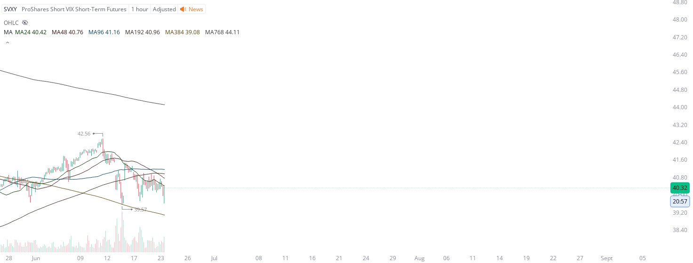

# Case Study #40 - Precision Buy Algorithm

**Archived from:** https://x.com/rauItrades/status/1937196577145401345  
**Post ID:** `1937196577145401345`  
**Posted:** 2025-06-23T17:10:30.000Z  
**Author:** @UnfairMarket (Unfair Market)  
**Thread posts captured:** 1  
**Status:** PARTIAL - conversation reports 7 replies; the public embed endpoint exposes a post's ancestors but not its descendants, so the forward reply chain is not archived.

---

### 1. `1937196577145401345` - 2025-06-23T17:10:30.000Z

Turkey, Tayyip Erdogan.
12th PM of Republic of Turkeye
[MA24 MA48 MA96 MA192 MA384 MA768]
Turkey, first in line protection of Qatari Airways

[MA384, SVXY at 39.57]
I've purchased the SVXY at 39.57, that's where banks placed an anticipatory buying program to short the VIX. https://t.co/wOESkB24Q0

metrics @capture - likes 0 / replies 0 / reposts 0 / quotes 0 / views 0

---
