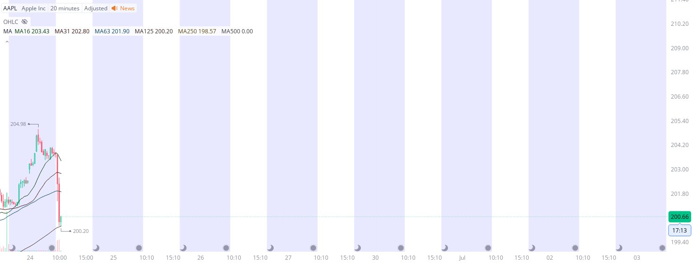

# Case Study #13 - Singular Point Hard Stop Order

**Archived from:** https://x.com/rauItrades/status/1937512126815641782  
**Post ID:** `1937512126815641782`  
**Posted:** 2025-06-24T14:04:22.000Z  
**Author:** @UnfairMarket (Unfair Market)  
**Thread posts captured:** 1  
**Status:** PARTIAL - conversation reports 6 replies; the public embed endpoint exposes a post's ancestors but not its descendants, so the forward reply chain is not archived.

---

### 1. `1937512126815641782` - 2025-06-24T14:04:22.000Z

I've speculated here on megacap leader $AAPL and bought AAPL at 200.20 .
MA16 MA31 MA63 MA125 MA250 MA500
Russia.
365 Outfit at 345.02 at [parm: MA125 at 200.20] https://t.co/Pud066UZWc

metrics @capture - likes 0 / replies 0 / reposts 0 / quotes 0 / views 0

---
