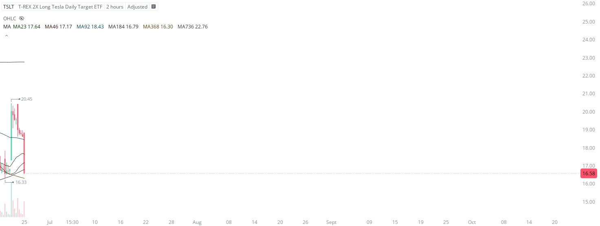

# Case Study #14 - Singular Point Hard Stop Order

**Archived from:** https://x.com/rauItrades/status/1937877644076622067  
**Post ID:** `1937877644076622067`  
**Posted:** 2025-06-25T14:16:49.000Z  
**Author:** @UnfairMarket (Unfair Market)  
**Thread posts captured:** 1  
**Status:** PARTIAL - conversation reports 2 replies; the public embed endpoint exposes a post's ancestors but not its descendants, so the forward reply chain is not archived.

---

### 1. `1937877644076622067` - 2025-06-25T14:16:49.000Z

I bought $TSLT at 16.33 as risk.
US judge blocks Trump's EV charger funding freeze
Administration 46.
[MA23 MA46 MA92 MA184 MA368 MA736]
[HARD-Stop order at selection of MA184 at 16.32] https://t.co/uiu0R1nYoj

metrics @capture - likes 0 / replies 0 / reposts 0 / quotes 0 / views 0

---
