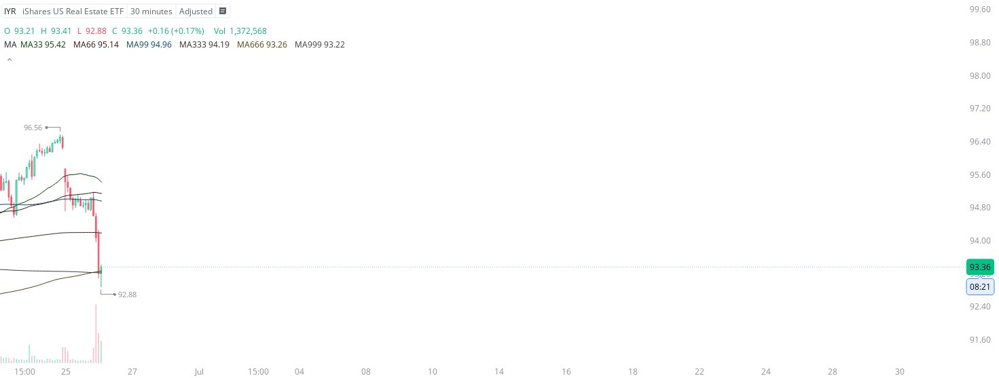

# Case Study #16 - Optimized Buying Algorithms

**Archived from:** https://x.com/rauItrades/status/1938241569012015183  
**Post ID:** `1938241569012015183`  
**Posted:** 2025-06-26T14:22:55.000Z  
**Author:** @UnfairMarket (Unfair Market)  
**Thread posts captured:** 1  
**Status:** PARTIAL - conversation reports 3 replies; the public embed endpoint exposes a post's ancestors but not its descendants, so the forward reply chain is not archived.

---

### 1. `1938241569012015183` - 2025-06-26T14:22:55.000Z

I think Real Estate insiders purchased $IVR .
So I bought the vehicle in anticipation of a move higher from
IVR at 92.88 . 

I'll liquidate the program on a singular penny break of the sequence. https://t.co/QDtjhelRXW

metrics @capture - likes 0 / replies 0 / reposts 0 / quotes 0 / views 0

---
