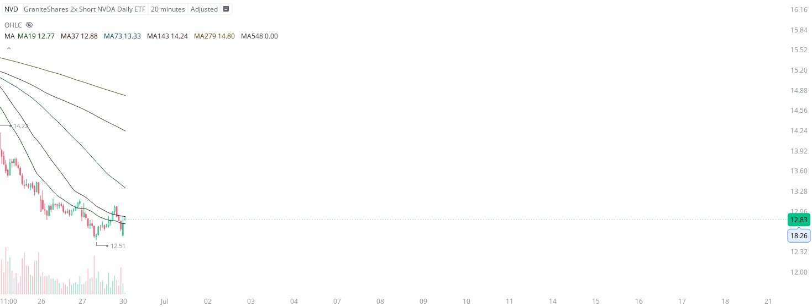

# Case Study #15 - Optimized Buying Algorithms

**Archived from:** https://x.com/rauItrades/status/1939681230595006602  
**Post ID:** `1939681230595006602`  
**Posted:** 2025-06-30T13:43:37.000Z  
**Author:** @UnfairMarket (Unfair Market)  
**Thread posts captured:** 1  
**Status:** PARTIAL - conversation reports 5 replies; the public embed endpoint exposes a post's ancestors but not its descendants, so the forward reply chain is not archived.

---

### 1. `1939681230595006602` - 2025-06-30T13:43:37.000Z

I've purchased the NVD with the institutional hour session low as risk. There was a string reversal program operating the NVDQ at 1.34 or '1.43' that I will capitalize on here.
This is my $NVD at 12.51 . https://t.co/rx1hh5eEvh

metrics @capture - likes 0 / replies 0 / reposts 0 / quotes 0 / views 0

---
