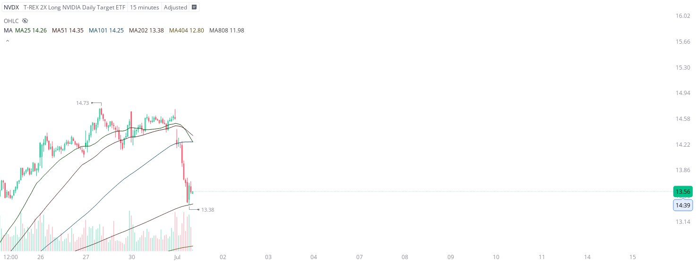

# Case Study #41 - Precision Buy Algorithm

**Archived from:** https://x.com/rauItrades/status/1940075634740666865  
**Post ID:** `1940075634740666865`  
**Posted:** 2025-07-01T15:50:50.000Z  
**Author:** @UnfairMarket (Unfair Market)  
**Thread posts captured:** 1  
**Status:** PARTIAL - conversation reports 3 replies; the public embed endpoint exposes a post's ancestors but not its descendants, so the forward reply chain is not archived.

---

### 1. `1940075634740666865` - 2025-07-01T15:50:50.000Z

NVDX at 13.38 .
For context I have made a great deal of money shorting NVDA by purchasing NVD yesterday and sharing that information live and in real time. You can look up [from:rauitrades NVD].

So now here's the:
NVDX T-REX 2X Long NVIDIA Daily Target ETF operating on the https://t.co/sasfJuYEv7

metrics @capture - likes 0 / replies 0 / reposts 0 / quotes 0 / views 0

---
