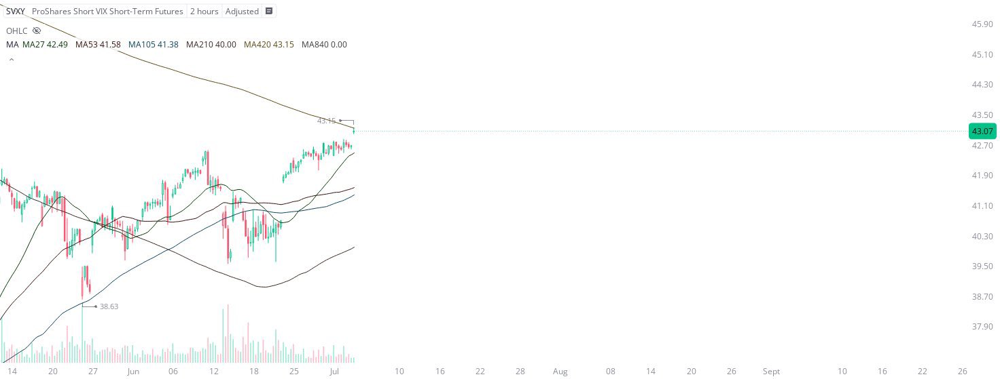

# Case Study #4 - Automated Short Orders

**Archived from:** https://x.com/rauItrades/status/1942033479023411515  
**Post ID:** `1942033479023411515`  
**Posted:** 2025-07-07T01:30:37.000Z  
**Author:** @UnfairMarket (Unfair Market)  
**Thread posts captured:** 1  
**Status:** PARTIAL - conversation reports 2 replies; the public embed endpoint exposes a post's ancestors but not its descendants, so the forward reply chain is not archived.

---

### 1. `1942033479023411515` - 2025-07-07T01:30:37.000Z

I’ve shared live and in real time why I sold the SVXY and purchased the VXX.
The SVXY at [2H][420][MA420 at 43.15] is operating on a conditional sell program.
The following real time frames will provide utmost visual clarity about how SMA outfits operate sell programs for profit. https://t.co/0MHStUpOPP

metrics @capture - likes 0 / replies 0 / reposts 0 / quotes 0 / views 0

---
