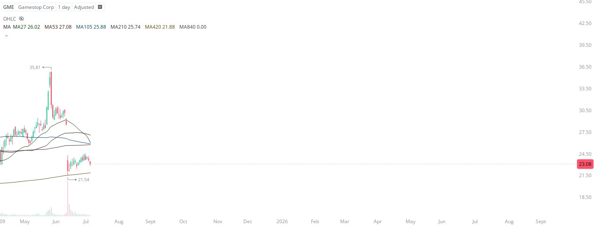

# Case Study #42 - Precision Buy Algorithm

**Archived from:** https://x.com/rauItrades/status/1942221360190943352  
**Post ID:** `1942221360190943352`  
**Posted:** 2025-07-07T13:57:11.000Z  
**Author:** @UnfairMarket (Unfair Market)  
**Thread posts captured:** 1  
**Status:** PARTIAL - conversation reports 24 replies; the public embed endpoint exposes a post's ancestors but not its descendants, so the forward reply chain is not archived.

---

### 1. `1942221360190943352` - 2025-07-07T13:57:11.000Z

Now that everyone can reckon with the fact that US equities do indeed operate on 'SMA Outfits', this is the NYSE's GME Gamestop Corp operating on the:
[GME][1D][420][at 21.54]

So what does that mean? It means there's a relevant protocol here skewing the GME equity higher here at https://t.co/5jBoO2HPwD

metrics @capture - likes 0 / replies 0 / reposts 0 / quotes 0 / views 0

---
