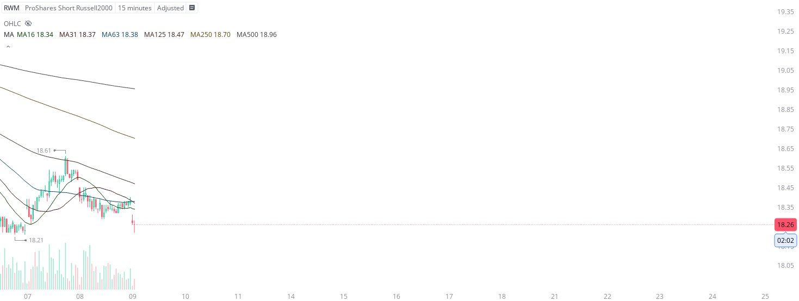

# Case Study #18 - Optimized Buying Algorithms

**Archived from:** https://x.com/rauItrades/status/1942946413027242243  
**Post ID:** `1942946413027242243`  
**Posted:** 2025-07-09T13:58:17.000Z  
**Author:** @UnfairMarket (Unfair Market)  
**Thread posts captured:** 1  
**Status:** PARTIAL - conversation reports 10 replies; the public embed endpoint exposes a post's ancestors but not its descendants, so the forward reply chain is not archived.

---

### 1. `1942946413027242243` - 2025-07-09T13:58:17.000Z

I've purchased the RWM again on this capitular low.
RWM at 18.21 is where banks have an established risk parameter and will only cut the trade on a single penny break of this operation. These same institutions used the [2000] SMA outfit to signal the program.

RWM at 18.21. https://t.co/oi7QlYEbkx

metrics @capture - likes 0 / replies 0 / reposts 0 / quotes 0 / views 0

---
