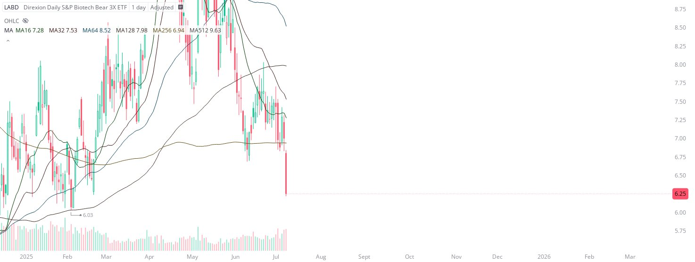

# Case Study #43 - Precision Buy Algorithm

**Archived from:** https://x.com/rauItrades/status/1943035665417146734  
**Post ID:** `1943035665417146734`  
**Posted:** 2025-07-09T19:52:57.000Z  
**Author:** @UnfairMarket (Unfair Market)  
**Thread posts captured:** 1  
**Status:** PARTIAL - conversation reports 6 replies; the public embed endpoint exposes a post's ancestors but not its descendants, so the forward reply chain is not archived.

---

### 1. `1943035665417146734` - 2025-07-09T19:52:57.000Z

I've purchased LABD with 6.03 as risk.
1D MA16 MA32 MA64 AA128 MA256 MA512
[MA128 at 6.03]. https://t.co/SBRpHqKiZ8

metrics @capture - likes 0 / replies 0 / reposts 0 / quotes 0 / views 0

---
