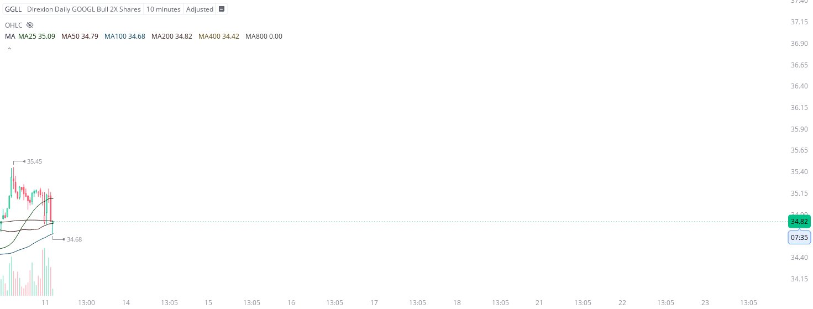

# Case Study #44 - Precision Buy Algorithm

**Archived from:** https://x.com/rauItrades/status/1943674970741068045  
**Post ID:** `1943674970741068045`  
**Posted:** 2025-07-11T14:13:19.000Z  
**Author:** @UnfairMarket (Unfair Market)  
**Thread posts captured:** 1  
**Status:** PARTIAL - conversation reports 4 replies; the public embed endpoint exposes a post's ancestors but not its descendants, so the forward reply chain is not archived.

---

### 1. `1943674970741068045` - 2025-07-11T14:13:19.000Z

I picked up GGLL 34.68 , I'll cut the trade on a singular penny break of the protocol. https://t.co/7BtxmIzKfc

metrics @capture - likes 0 / replies 0 / reposts 0 / quotes 0 / views 0

---
