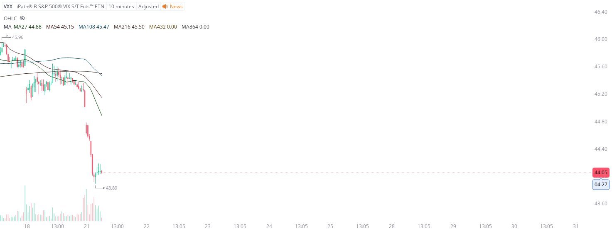

# Case Study #19 - Optimized Buying Algorithms

**Archived from:** https://x.com/rauItrades/status/1947314924121940314  
**Post ID:** `1947314924121940314`  
**Posted:** 2025-07-21T15:17:11.000Z  
**Author:** @UnfairMarket (Unfair Market)  
**Thread posts captured:** 1  
**Status:** PARTIAL - conversation reports 5 replies; the public embed endpoint exposes a post's ancestors but not its descendants, so the forward reply chain is not archived.

---

### 1. `1947314924121940314` - 2025-07-21T15:17:11.000Z

I've purchased the VXX at 43.89 .
I will cut the trade on a singular penny break of the program's selection. https://t.co/XfTgmVTCbF

metrics @capture - likes 16 / replies 5 / reposts 3 / quotes 1 / views 4372

---
