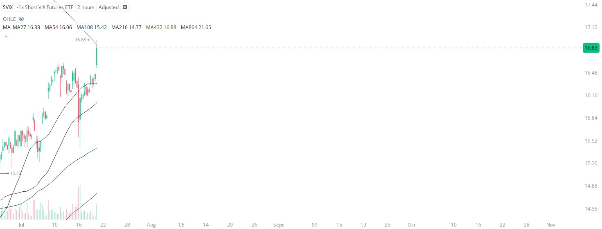

# Case Study #5 - Automated Short Orders

**Archived from:** https://x.com/rauItrades/status/1947315205622645048  
**Post ID:** `1947315205622645048`  
**Posted:** 2025-07-21T15:18:19.000Z  
**Author:** @UnfairMarket (Unfair Market)  
**Thread posts captured:** 1  
**Status:** PARTIAL - conversation reports 6 replies; the public embed endpoint exposes a post's ancestors but not its descendants, so the forward reply chain is not archived.

---

### 1. `1947315205622645048` - 2025-07-21T15:18:19.000Z

I've shorted the SVIX at 16.88 .
There's a high frequency short operating on the outfit:
[MA27 MA54 MA108 MA216 MA432 MA864]
This outfit is a cryptographic play on binary and the sequential descent of the integers 4, 3, and 2 of 432.
Or the... 432 Outfit.

[MA432 at 16.88],
This https://t.co/K2nikX3U7F

metrics @capture - likes 3 / replies 2 / reposts 1 / quotes 0 / views 203

---
