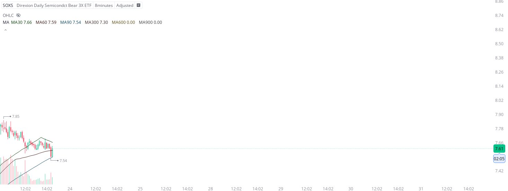

# Case Study #20 - Optimized Buying Algorithms

**Archived from:** https://x.com/rauItrades/status/1948088844764741770  
**Post ID:** `1948088844764741770`  
**Posted:** 2025-07-23T18:32:28.000Z  
**Author:** @UnfairMarket (Unfair Market)  
**Thread posts captured:** 1  
**Status:** PARTIAL - conversation reports 3 replies; the public embed endpoint exposes a post's ancestors but not its descendants, so the forward reply chain is not archived.

---

### 1. `1948088844764741770` - 2025-07-23T18:32:28.000Z

I've purchased SOXS at 7.54 . I will cut the trade on a singular penny break of the program's selection. https://t.co/PqaGoanVoO

metrics @capture - likes 0 / replies 0 / reposts 0 / quotes 0 / views 0

---
