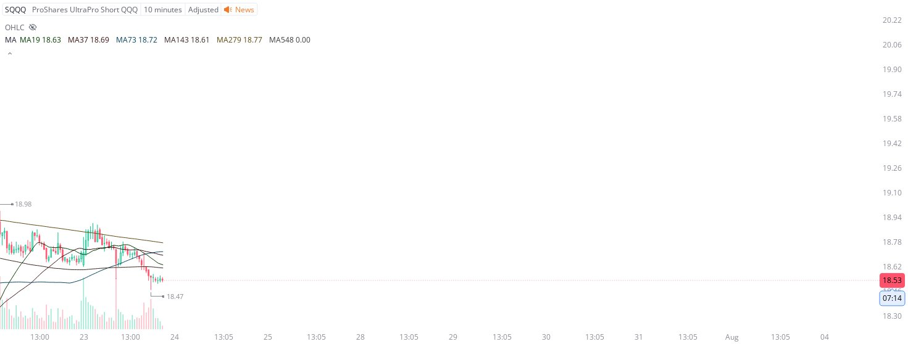

# Case Study #21 - Optimized Buying Algorithms

**Archived from:** https://x.com/rauItrades/status/1948099281543704984  
**Post ID:** `1948099281543704984`  
**Posted:** 2025-07-23T19:13:57.000Z  
**Author:** @UnfairMarket (Unfair Market)  
**Thread posts captured:** 1  
**Status:** PARTIAL - conversation reports 4 replies; the public embed endpoint exposes a post's ancestors but not its descendants, so the forward reply chain is not archived.

---

### 1. `1948099281543704984` - 2025-07-23T19:13:57.000Z

I've purchased SQQQ here from this program at 18.47 .
I will cut the trade on a singular penny break of the protocol.

I purchased SQQQ here because of the [SOXS 8M MA30 MA60 MA90 MA300 MA600 MA900 MA90  at 7.54] and  I have only purchased the SOXS because the VXX/SVXY, following https://t.co/DJSCtTp0ki

metrics @capture - likes 0 / replies 0 / reposts 0 / quotes 0 / views 0

---
