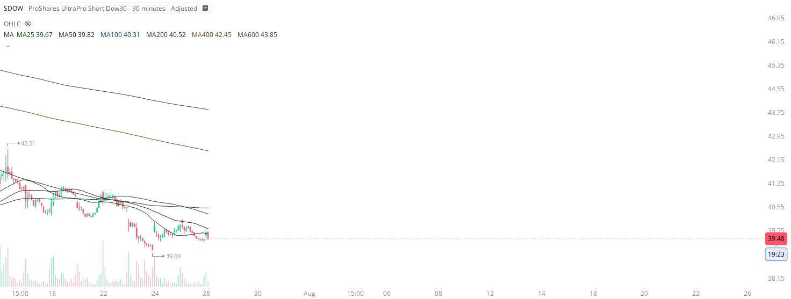

# Case Study #22 - Optimized Buying Algorithms

**Archived from:** https://x.com/rauItrades/status/1949835108959285454  
**Post ID:** `1949835108959285454`  
**Posted:** 2025-07-28T14:11:30.000Z  
**Author:** @UnfairMarket (Unfair Market)  
**Thread posts captured:** 1  
**Status:** PARTIAL - conversation reports 6 replies; the public embed endpoint exposes a post's ancestors but not its descendants, so the forward reply chain is not archived.

---

### 1. `1949835108959285454` - 2025-07-28T14:11:30.000Z

And finally, amid ending trade talks I've purchased $SDOW
with the capitular low of 39.09, with banks, as risk. https://t.co/Fa00myC5ms

metrics @capture - likes 0 / replies 0 / reposts 0 / quotes 0 / views 0

---
