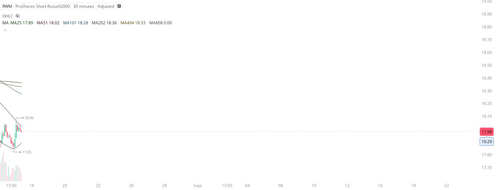

# Case Study #15 - Singular Point Hard Stop Order

**Archived from:** https://x.com/rauItrades/status/1956390689404768587  
**Post ID:** `1956390689404768587`  
**Posted:** 2025-08-15T16:21:02.000Z  
**Author:** @UnfairMarket (Unfair Market)  
**Thread posts captured:** 1  
**Status:** PARTIAL - conversation reports 7 replies; the public embed endpoint exposes a post's ancestors but not its descendants, so the forward reply chain is not archived.

---

### 1. `1956390689404768587` - 2025-08-15T16:21:02.000Z

As a final conditional base trade, I've purchased the RWM with the [30M MA25 at 17.85 as risk].
This is the RWM 30M 404 MA25 at 17.85 . https://t.co/KQsEIPBtyE

metrics @capture - likes 0 / replies 0 / reposts 0 / quotes 0 / views 0

---
